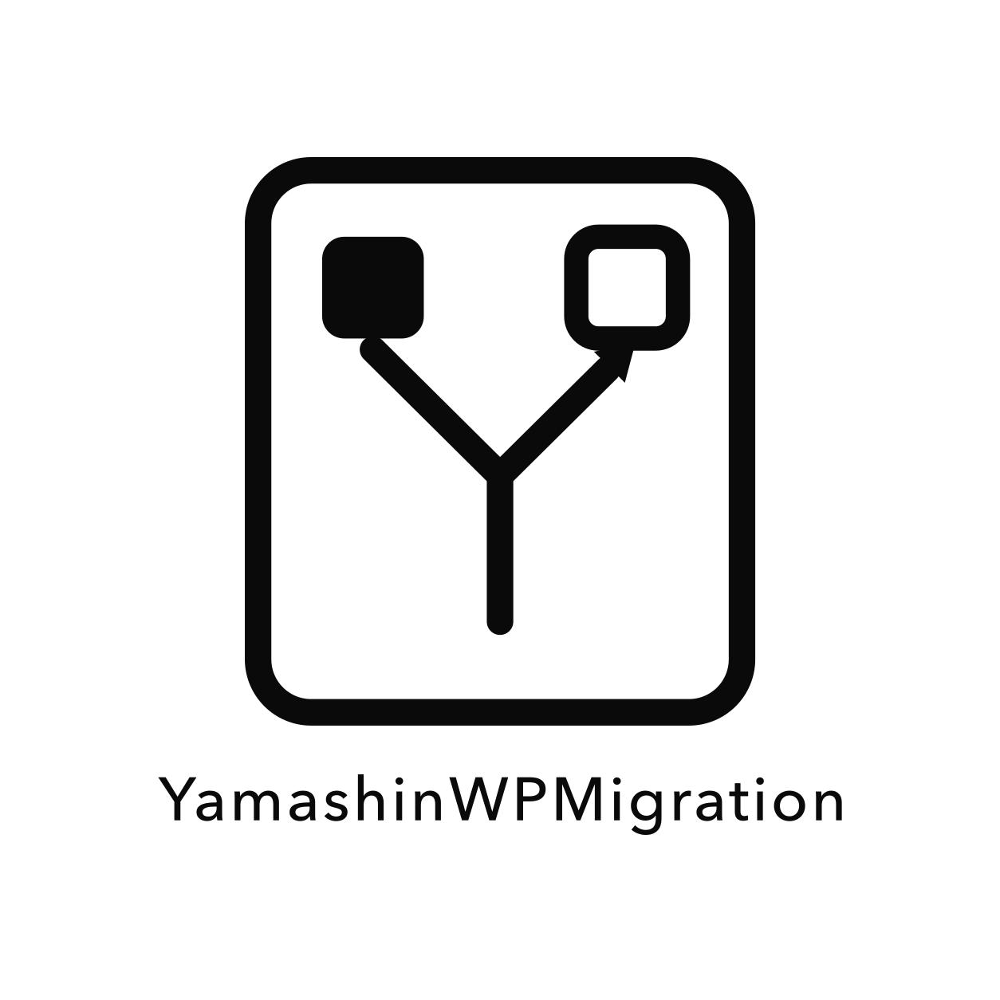

<p align="center">
  
</p>

# Yamashin WP Migration

山真研究室が、自分たちのWordPress運用のために開発している一方向・差分移行プラグインです。ローカル／ステージング／本番を明示的に接続し、`push`または`pull`ごとに移行方向を固定します。自動の双方向同期は行いません。

[最新版を無料ダウンロード](https://github.com/flares-llc/yamashin-wp-migration/releases/latest)

## できること

- 投稿、固定ページ、CPT、分類、メタ、コメント、添付、Uploads、ユーザー、許可したオプション、登録済み独自テーブルを移行
- テーマ、プラグイン、mu-plugin、同一バージョンのWordPress本体を内容ハッシュで比較・転送
- 可搬UID、正規化JSON、SHA-256、256個のMerkleバケットによる差分検知
- 前回の検証済みreceiptを共通基点にした三方向差分と、項目単位の競合解決
- 容量・権限・バージョン・必要オブジェクトを検査するドライラン
- `plan_hash`と一度限りの確認値で拘束された適用、明示確認式の削除
- 適用前スナップショット、自動ロールバック、保持期間中の手動ロールバック
- HMAC署名REST APIと、専用トークンで使うStreamable HTTP MCP
- 再開可能なチャンク転送、ハッシュ検証、再送、重複排除
- 100項目単位の再開可能な適用jobと、接続元から接続先への中止・ロールバック伝播
- 同一manifestをステージングで検証したreceiptを条件にできる本番昇格ゲート

## 安全境界

- 受信はサイトごとに明示的に有効化し、公開ホスト間はHTTPS必須
- 競合は既定で停止、削除は既定OFF。削除には全体許可、対象スコープ許可、確定対象一覧の再確認が必要
- `siteurl`、`home`、`wp-config.php`、暗号鍵、認証・ライセンス情報、cron、当プラグインの接続状態は移行しない
- ユーザーはloginで統合し、セッションは移行しない。パスワードハッシュは設定で明示した場合のみ移行
- 現在の管理者と最後の管理者は削除せず、移行先の緊急管理経路を残す
- WordPress本体は同一バージョンだけを対象とし、バージョン更新機能としては使用しない

対応外: WordPress Multisite、WordPress版更新、秘密情報込み完全クローン、SSH、GCS／Google Drive保存。

## 要件

- WordPress 6.0以上（同一版の環境間で使用）
- PHP 8.0以上
- MySQL 5.7以上またはMariaDB 10.4以上を推奨
- OpenSSL、JSON、hash拡張
- 書き込み可能な`wp-content`と、変更対象以上の退避容量

## セットアップ

1. [releases/latest](https://github.com/flares-llc/yamashin-wp-migration/releases/latest)からZIPを取得し、両サイトへインストールします。
2. 両サイトの`wp-config.php`へ、別途安全に生成した`FSYNC_ENCRYPTION_KEY`を設定します。
3. 受信側の「Yamashin WP Migration → 接続」で受信を有効にし、用途に合う権限の接続情報を発行します。
4. 移行元へ一度限りの接続情報を貼り付けます。
5. 「移行」で接続先、`push` / `pull`、プロファイルを選び、転送を完了させます。`pull`は接続先からこのサイトへ戻る方向にも同じ手順でペアリングしておきます。
6. 差分、競合、削除、容量、警告と`plan_hash`を確認してから適用します。

暗号化キーを省略するとWordPressソルト由来になります。ソルト変更時に保存済み認証情報を復号できなくなるため、固定の`FSYNC_ENCRYPTION_KEY`を推奨します。

## 設定

設定は管理画面、または`wp-content/flares-sync.config.jsonc`で管理します。ファイルが存在する場合はファイルが正となり、管理画面からの上書きを拒否します。秘密値は設定へ書かず、認証情報ストアのIDだけを参照してください。

設定例は[`flares-sync.config.example.jsonc`](flares-sync.config.example.jsonc)です。サイト固有JSON Schemaは管理画面、REST、MCPの`config_schema`から取得できます。

削除は二重の設定が必要です。

```jsonc
{
  "sync": {
    "scope": {
      "post_types": {
        "post": { "delete": true }
      }
    },
    "policy": { "allow_delete": true }
  }
}
```

この設定だけでは削除されません。ドライラン後、確定した削除一覧をもう一度確認して初めて`plan_hash`へ含まれます。

## AI / MCP

WordPress側のMCP endpoint:

```text
https://example.com/?rest_route=/flares-sync/v1/mcp
```

管理画面で専用MCPトークンを発行します。トークンはハッシュだけを保存し、平文は一度しか表示しません。読み取り、移行、ロールバックをcapabilityで分離できます。

stdioクライアントからは同梱ブリッジを使用します。

```json
{
  "mcpServers": {
    "yamashin-wp-migration": {
      "command": "npx",
      "args": [
        "--yes",
        "--package=https://github.com/flares-llc/yamashin-wp-migration/releases/latest/download/yamashin-wp-migration-mcp.tgz",
        "yamashin-wp-migration-mcp"
      ],
      "env": {
        "FSYNC_SITE_URL": "https://example.com/",
        "FSYNC_MCP_TOKEN": "one-time-issued-token"
      }
    }
  }
}
```

AI向け入口は[`llms.txt`](llms.txt)、実装規約は[`AGENTS.md`](AGENTS.md)、MCP仕様は[`docs/MCP.md`](docs/MCP.md)です。

## 公開仕様

- [アーキテクチャ](docs/ARCHITECTURE.md)
- [可搬形式](docs/PORTABLE_FORMAT.md)
- [三方向差分](docs/DIFF_ALGORITHM.md)
- [REST / OpenAPI](docs/REST_API.md)
- [MCP](docs/MCP.md)
- [権限・脅威モデル](docs/THREAT_MODEL.md)
- [運用](docs/OPERATIONS.md)
- [復旧](docs/RECOVERY.md)
- [JSON Schema](schemas/)

内部slug、設定ファイル名、REST namespace、DB接頭辞、署名プロトコルは互換性のため`flares-sync`を維持しています。

## 開発・検証

```bash
docker run --rm -v "$PWD":/app -w /app php:8.0-cli php tests/run.php
docker compose up -d
docker compose --profile setup run --rm setup
./docker/verify-pairing.sh staging
./docker/verify-pairing.sh production
npm --prefix mcp ci
npm --prefix mcp run check
```

Docker環境は`local:8091`、`staging:8092`、`production:8093`です。詳細な検証手順は[`HANDOFF.md`](HANDOFF.md)を参照してください。

## 公開方針

ソースは参照・自己利用のため公開していますが、山真研究室自身の用途を優先するプロジェクトです。Issues、Discussions、機能要望、修正提案、外部Pull Requestは受け付けません。脆弱性だけは[非公開で報告](https://github.com/flares-llc/yamashin-wp-migration/security/advisories/new)してください。詳しくは[`CONTRIBUTING.md`](CONTRIBUTING.md)と[`SECURITY.md`](SECURITY.md)を参照してください。

## ライセンス

[GPL-2.0-or-later](LICENSE) © 山真研究室
